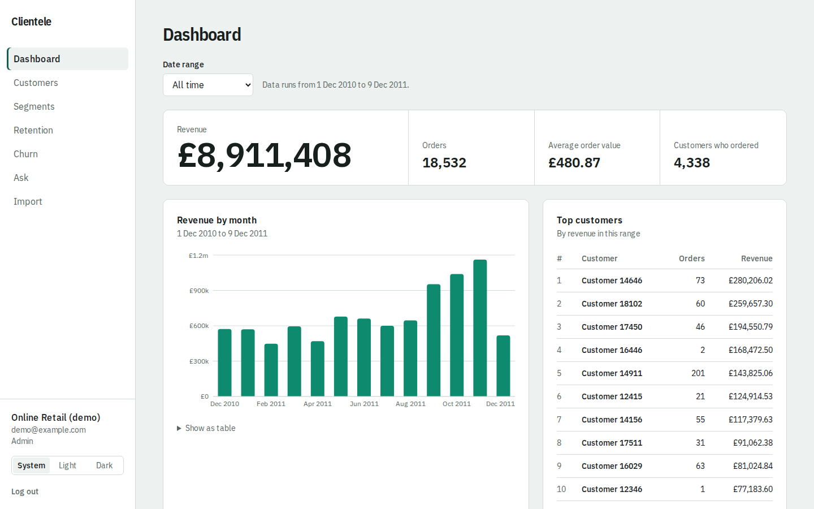
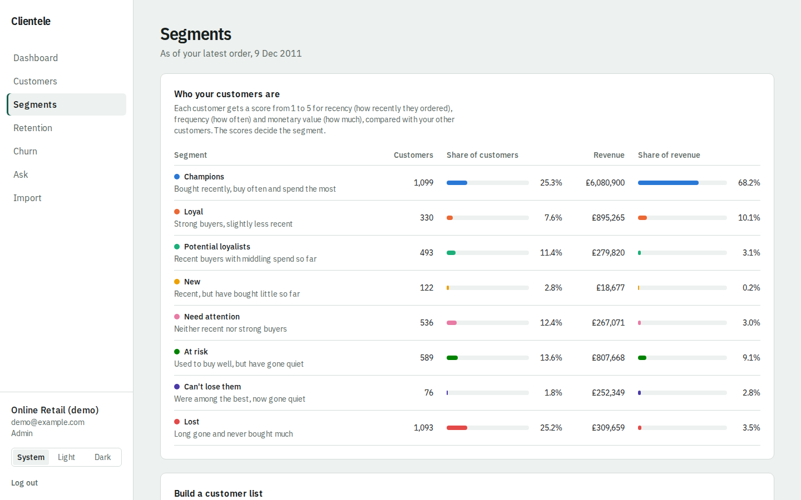
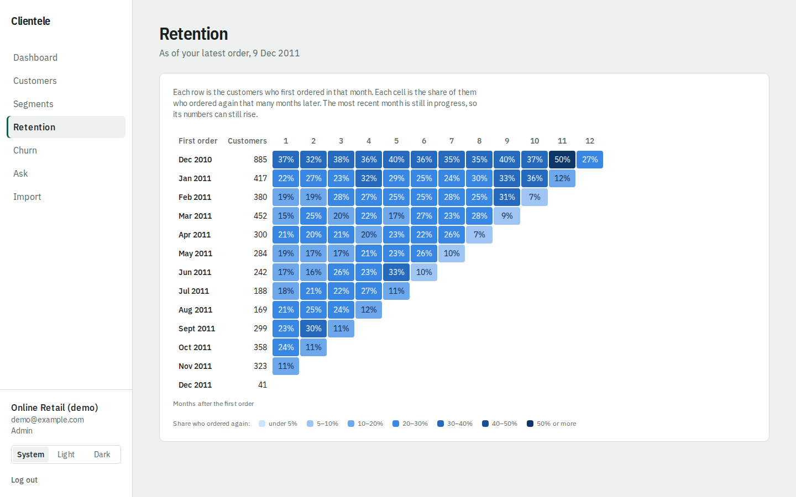
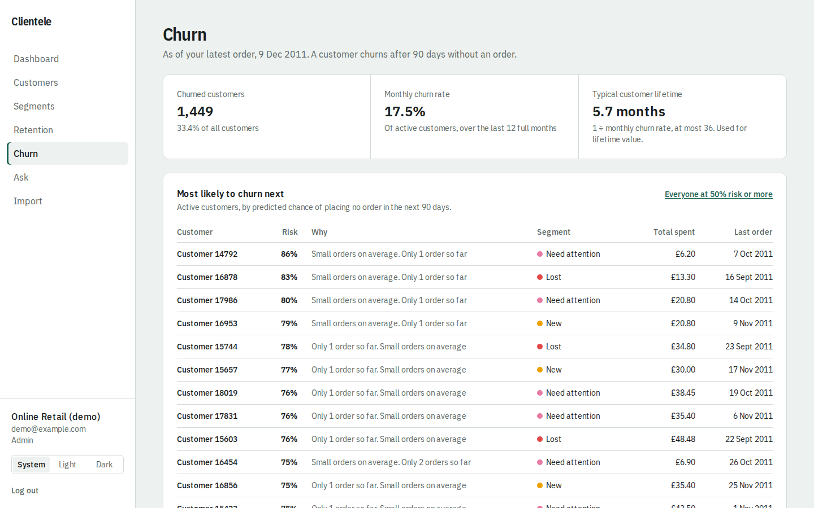
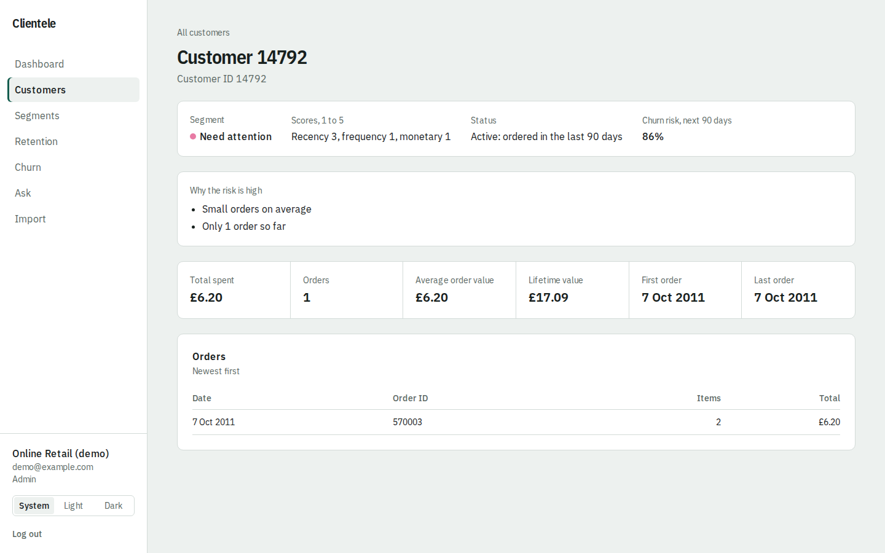
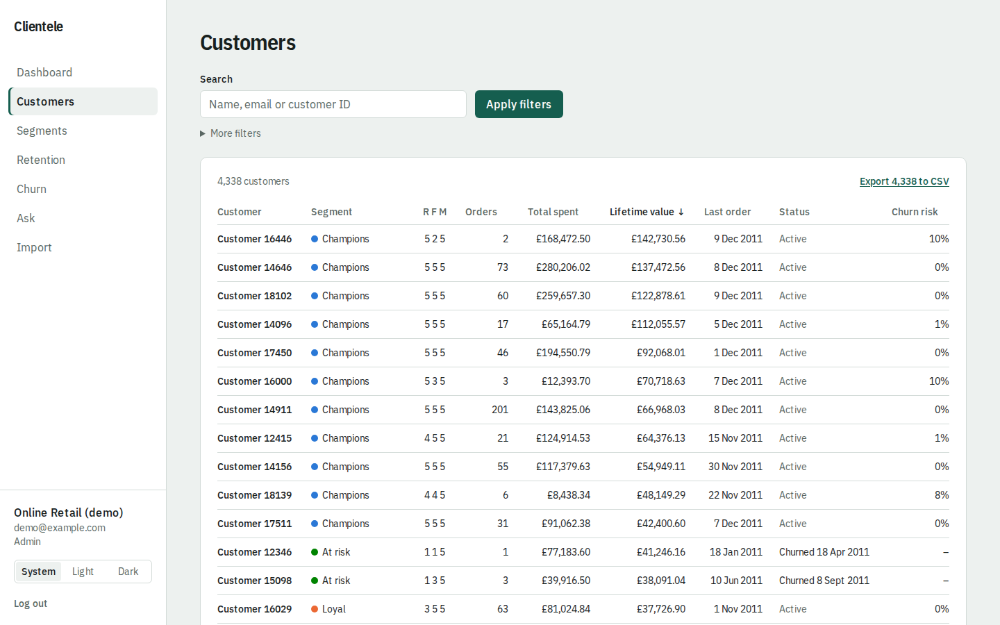
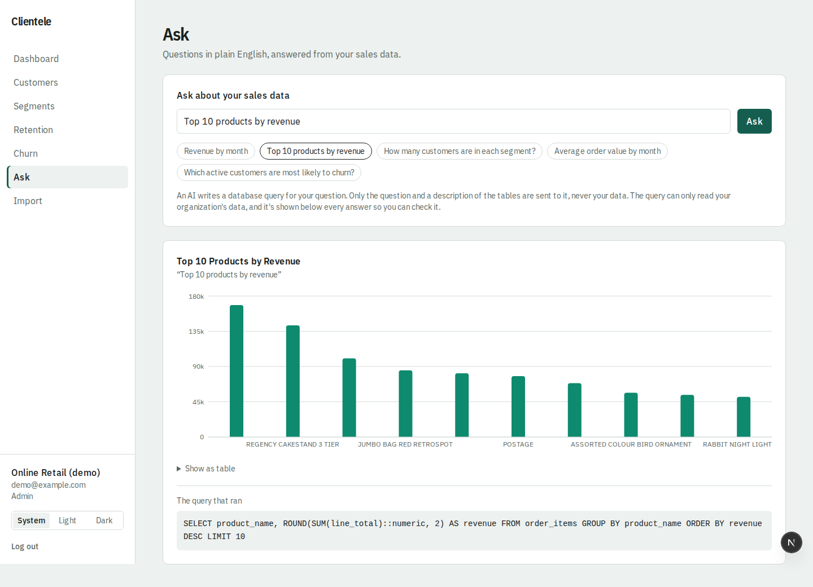
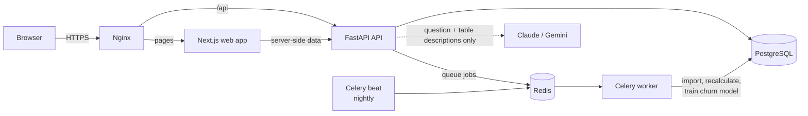

# Clientele

**Customer analytics for small businesses: upload your sales, see which customers to keep, grow and win back.**

[](https://github.com/ChintaSuryaTeja/ClinteleCRM/actions/workflows/ci.yml)



Most small shops have years of order history sitting in spreadsheets and no
time to analyse it. Clientele turns that export into answers: who your best
customers are, who is drifting away, how long customers stay, what each one
is worth, and which ones to contact this week before they're gone.

Upload a CSV or Excel file of orders and Clientele does the rest in the
background: it cleans and checks every row, groups customers into segments,
tracks retention month by month, estimates lifetime value, and uses a
machine-learning model to flag the customers most likely to leave, with the
reasons in plain English. Ask a question like *"Top 10 products by revenue"*
and get a chart, along with the exact database query that produced it.

It is multi-tenant: many businesses share one deployment, and each sees only
its own data, enforced in the API **and** in the database itself.

> Personal portfolio project, built end to end: product, backend, data
> science, frontend and DevOps.

---

## Features

**Bring in your data**
- CSV and Excel (.xlsx) upload, processed as a background job with live status
- Row-by-row validation; problem rows go to a downloadable error report while
  the rest import
- Re-uploading is safe: orders seen before are skipped, never double-counted
- Delete an import (its orders go with it) or add a single order by hand

**Understand your customers**
- **Dashboard:** revenue over time, average order value, top customers, with a
  date-range filter that answers in milliseconds from pre-computed daily tables
- **RFM segments:** every customer scored 1–5 on recency, frequency and
  monetary value, grouped into 8 segments (Champions, At risk, Can't lose
  them…), with the same colour for a segment on every screen
- **Segment builder:** combine segments, scores, lifetime value, churn status
  and churn risk, then export the list to CSV
- **Cohort retention:** a heatmap of how many customers from each first-order
  month come back 1, 2, 3… months later
- **Lifetime value** and **churn history** (a customer churns after 90 days
  without an order), with a monthly churn-rate trend

**Act before customers leave**
- **Churn prediction:** a scikit-learn model gives every active customer a risk
  score for the next 90 days and up to three reasons, e.g. *"No order for 64
  days; usually orders every 21"*
- The model is tested on a period it never saw and compared with a simple
  rule; on the demo data it ranks churners correctly **75% of the time vs 60%**
  for "longest since last order"
- **Ask in plain English:** an AI (Claude or Gemini) writes one read-only SQL
  query, shown next to the chart so you can check it

**Built for teams**
- Organizations with **admin** (import, manage users) and **viewer** (read,
  export) roles
- Light and dark mode, laptop and phone layouts, loading/empty/error states on
  every screen

## Screenshots

| | |
|---|---|
|  **Segments**: who your customers are |  **Retention**: cohort heatmap |
|  **Churn**: who is likely to leave next, and why |  **Customer**: scores, risk and reasons |
|  **Customers**: filter, sort, export |  **Ask**: a question, a chart and its SQL |

*Screens show the public [UCI Online Retail dataset](https://archive.ics.uci.edu/dataset/352/online+retail)
(a UK online gift shop, Dec 2010 – Dec 2011, about 400,000 order lines).*

---

## Tech stack

| Area | Technology |
|---|---|
| **Frontend** | Next.js 16 (App Router, server components), React 19, TypeScript 5, Tailwind CSS 4, Recharts 3 |
| **Backend API** | Python 3.12, FastAPI, Pydantic 2, SQLAlchemy 2, Alembic (migrations), Uvicorn |
| **Background jobs** | Celery 5 with Redis 7 (imports, deletes, nightly recalculation via Celery beat) |
| **Database** | PostgreSQL 17: raw tables, pre-computed metric tables, row-filtered views for AI queries |
| **Data science** | scikit-learn (logistic regression, gradient boosting for comparison), NumPy, SQL window functions for RFM and cohorts |
| **AI / natural language** | Anthropic Claude API or Google Gemini API (structured JSON output), sqlglot (SQL parsing and validation) |
| **Auth & security** | JWT in an HttpOnly, Secure cookie, Argon2 password hashing, role checks, organization-scoped composite foreign keys, a restricted Postgres role for AI-written SQL |
| **Testing** | pytest (180 tests), Playwright (9 browser tests against the production build), Terraform tests (7, mock provider) |
| **Code quality** | Ruff (lint + format), ESLint, Prettier, TypeScript strict checks, actionlint, ShellCheck |
| **DevOps** | Docker and Docker Compose, Nginx (HTTPS, security headers, rate limiting), Let's Encrypt, GitHub Actions (CI + deploy workflow), GitHub Container Registry |
| **Monitoring** | Prometheus, Grafana (provisioned dashboard), node / postgres / redis exporters |
| **Infrastructure as code** | Terraform for an Oracle Cloud "Always Free" ARM server, with cloud-init |
| **Tooling** | uv (Python packages), npm |

## How it works



- **Compute ahead, read fast.** The worker recalculates everything after each
  import and every night, and stores it in PostgreSQL. Screens only read
  pre-computed numbers, so they stay fast with hundreds of thousands of orders.
- **Isolation in two layers.** Every query filters by the logged-in user's
  organization, *and* the database's foreign keys include the organization, so
  one company's order can't point at another company's customer even if the
  code had a bug.
- **No peeking at the future.** The churn model learns from past cutoff dates
  using only orders before each cutoff, and is scored on a later period it
  never saw.
- **AI-written SQL, safely.** The query is parsed (one SELECT, allowed tables
  and functions only), then run as a database role that can only read views
  filtered to your organization, read-only, with a 5-second timeout and a
  1,000-row cap. The AI never sees your data, only the question and the table
  descriptions.

---

## Run it on your computer

Works on **Windows, macOS and Linux**. Everything runs inside Docker, so you
don't need Python, Node.js or PostgreSQL installed.

### 1. Install the prerequisites
- [**Docker Desktop**](https://www.docker.com/products/docker-desktop/) (on
  Linux, Docker Engine with the Compose plugin). Start it and wait until it
  says it's running. Give it at least **4 GB of memory** (Settings → Resources).
- [**Git**](https://git-scm.com/downloads)

### 2. Get the code
```sh
git clone https://github.com/ChintaSuryaTeja/ClinteleCRM.git
cd ClinteleCRM
```

### 3. Create your settings file
Copy the template:
```sh
cp .env.example .env            # Windows PowerShell: Copy-Item .env.example .env
```
Then open `.env` in a text editor and set two values to long random strings:
`POSTGRES_PASSWORD` and `JWT_SECRET`. To generate one:

| Your system | Command |
|---|---|
| macOS / Linux / Git Bash | `openssl rand -hex 32` |
| Windows PowerShell | `$b = New-Object byte[] 32; [Security.Cryptography.RandomNumberGenerator]::Create().GetBytes($b); -join ($b \| ForEach-Object { $_.ToString("x2") })` |

Run it twice, once for each value. `.env` is ignored by Git, so your values
stay on your machine.

### 4. Start the app
```sh
docker compose up --build
```
The first start downloads and builds everything, which takes a few minutes.
It's ready when the log shows `Ready` for the web app. Then open
**http://localhost:3000** and click **Create an account**.

To stop it, press `Ctrl+C` (or run `docker compose down`). Your data is kept
for next time; `docker compose down -v` wipes it.

### 5. Load the demo data (optional, recommended)
In a second terminal, from the same folder:
```sh
docker compose exec api python -m scripts.seed --password choose-a-password
```
This downloads the public UCI Online Retail dataset (about 23 MB) and imports
it through the normal pipeline, which takes about a minute and a half. Then
log in as **demo@example.com** with the password you chose.

### 6. Turn on "Ask" (optional)
Plain-English questions need an AI API key. Add **one** of these to `.env`,
then restart with `docker compose up -d api`:
```ini
# Google Gemini (key from https://aistudio.google.com/apikey)
ASK_PROVIDER=google
GOOGLE_API_KEY=your-key

# or Anthropic Claude (key from https://console.anthropic.com)
ASK_PROVIDER=anthropic
ANTHROPIC_API_KEY=sk-ant-...
```
Everything else works without a key; the Ask screen then explains how to set
it up.

### Importing your own data
Admins upload a file on the **Import** screen (a template is linked there).
One row per product in an order; column names in any order and any case:

| Column | Required | Example |
|---|---|---|
| `order_id` | yes | `1001` |
| `order_date` | yes | `2024-03-01` or `2024-03-01 14:05` (no timezone means UTC) |
| `customer_id` | yes | `C-001` |
| `product_code` | yes | `MUG-01` |
| `quantity` | yes | `2` (a whole number above zero) |
| `unit_price` | yes | `12.50` |
| `customer_name`, `customer_email`, `product_name` | no | |

CSV files must be UTF-8 (in Excel: *Save as → CSV UTF-8*).

### Troubleshooting
- **Use `localhost`, not `127.0.0.1`.** The development server only serves
  its scripts to `localhost`.
- **"Port is already allocated":** something else uses port 3000 or 8000.
  Stop it, or change the left-hand port numbers in `docker-compose.yml`.
- **Out-of-memory or very slow builds:** raise Docker Desktop's memory limit.
- **Edits not showing up** (Windows): the dev setup already polls for file
  changes; give it a few seconds, or restart with `docker compose restart web`.

---

## Run the tests

With the app running (`docker compose up`):
```sh
docker compose exec api pytest              # 180 API tests (uses a separate test database)
docker compose exec api ruff check .        # Python lint
docker compose exec web npm run lint        # ESLint
docker compose exec web npm run typecheck   # TypeScript
```
The test suite includes a hand-calculated answer for every metric and checks
that one organization can never read another's data.

The browser tests and Terraform tests run in GitHub Actions on every push
(see [`.github/workflows/ci.yml`](.github/workflows/ci.yml)).

## Try the production setup locally

The production configuration (Nginx + HTTPS, compiled images, monitoring,
backups) can run on your computer with a self-signed certificate. From
**Git Bash, macOS or Linux** (on Git Bash, put `MSYS_NO_PATHCONV=1` in front
of the `sh` command):

```sh
cd deploy
cp .env.production.example .env.production   # fill in the passwords and secret
sh scripts/local-certificate.sh
docker compose -f docker-compose.prod.yml -f docker-compose.local.yml \
  --env-file .env.production up -d --build
```
Open **https://localhost** (accept the browser's certificate warning) and
**https://localhost/grafana/** for monitoring (user `admin`). It uses ports
80 and 443.

## Deployment

Everything needed to host it on a free Oracle Cloud "Always Free" ARM server
is in the repo but **not switched on**:

- [`infra/`](infra/): Terraform for the server, network and firewall, with
  rules that refuse anything outside the free tier or SSH open to the internet
- [`deploy/`](deploy/): production Compose file, Nginx, Let's Encrypt scripts,
  Prometheus/Grafana, nightly backups
- [`.github/workflows/deploy.yml`](.github/workflows/deploy.yml): after CI
  passes on `main`, publishes ARM images; the server pulls them every 5
  minutes. Enabled by setting the repository variable `DEPLOY_ENABLED=true`.

## Project structure

```
api/            FastAPI app, Celery worker, metrics, churn model, Ask (Python)
  app/            routers, models, importer, metrics, churn_model, ask_sql
  alembic/        database migrations
  tests/          pytest suite
  scripts/seed.py demo data loader
web/            Next.js app (TypeScript)
  src/app/        screens: dashboard, customers, segments, retention, churn, ask, import
e2e/            Playwright browser tests
deploy/         production Compose, Nginx, monitoring, backups
infra/          Terraform for the server
docs/           screenshots
```

## Data

Demo data: *Online Retail* dataset by Daqing Chen, UCI Machine Learning
Repository, licensed [CC BY 4.0](https://creativecommons.org/licenses/by/4.0/).
